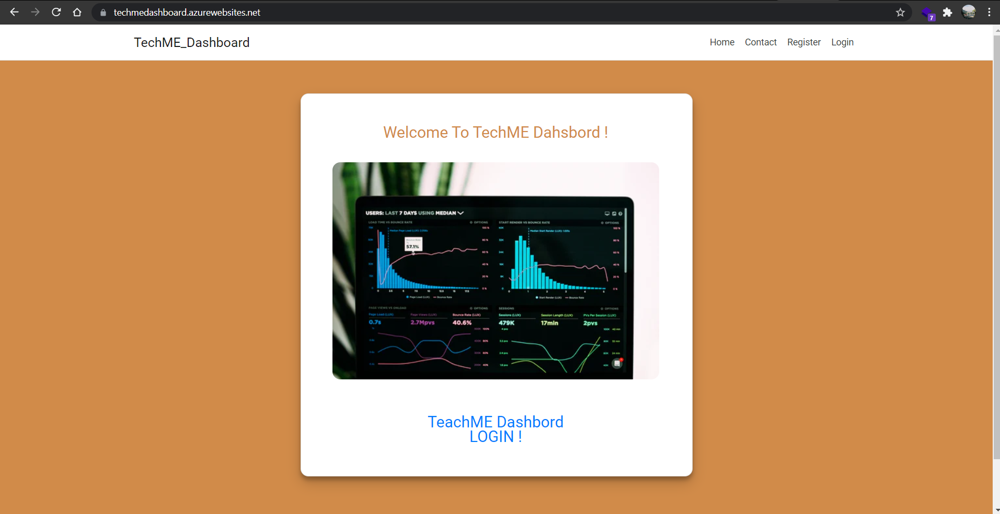
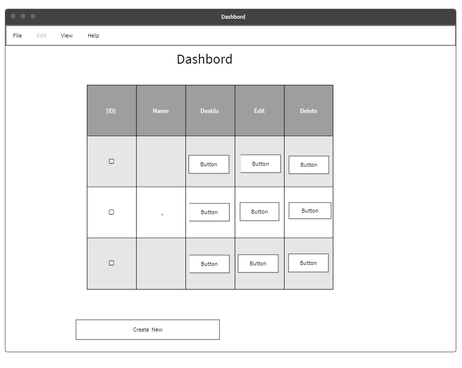

   <div dir="rtl" align="Center" >
   
   </div>
  
  #   <div dir="rtl" align="Center" > اسم التطبيق | (TechME Dashbord)  </div>
 
  ### المقدمــة | Introduction
  
  فكرة هذا الموقع عبارة عن لوحة تحكم يقوم بادارتها مدير النظام من خلال حذف واضافة وتعديل المعلومات على  الجداول  .
### Demo
  
  > [https://techmedashboard.azurewebsites.net/]
  


###  Wireframe  
 <br>
  
  
  ####   HomePage wirefram  <br>

  
 
       <br>   
   
   
  ####   Dashbord  wirefram 
 
       <br>
   
   
 #### Contct page wirefram 

  
       <br>
   
   

   
   

 ### ER Diagram 
   
     <br>
    

 

### Set up  
### Prerequisites
- NET 5 
- ASP.NET MVC
- Microsoft SQL Server 
### Set up  
 #### Database
 ``` dotnet ef database update```
### Front-End  
 - HTML
 - CSS
 - JS
 - Jquery
 - Bootstrap 
### Back-End 
 - ASP.NET MVC
 - MSSQL Server
 - EF Core
### Author
 
رهف القحطاني 
### License & Resource
 .....
</div>
